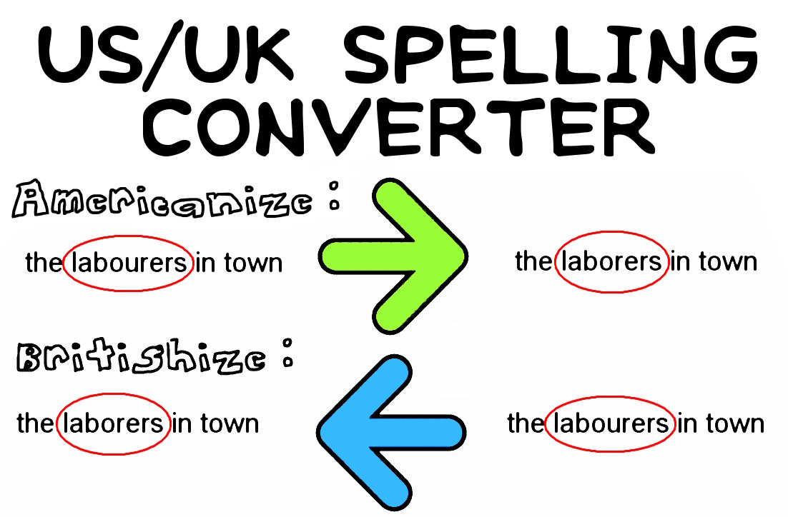
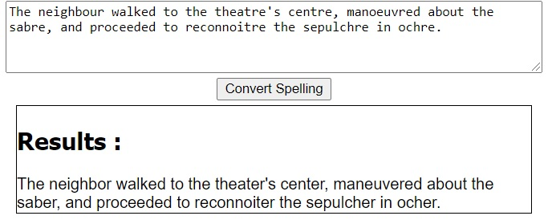
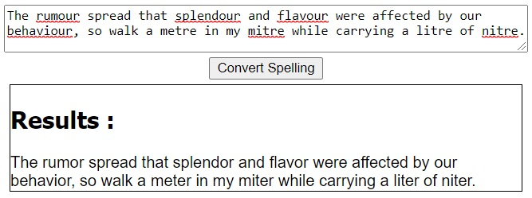
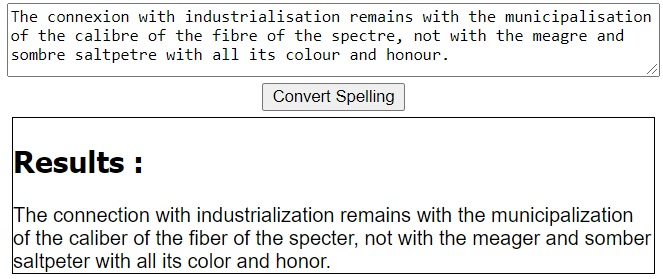

# US/UK Spelling Converter

*You* provide the text, with either US/UK-spelling.

*We* return the same text, converted to either system.

We have you covered -- for about 20,000 words.

## TOC

1. [TOC](#toc)
2. [Online Demos](#online-demos)
3. [Features](#features)
4. [Functionality](#funtionality)
5. [Example Usage](#example-usage)
6. [Code Structure and Design](#code-structure-and-design)

## Online Demos

_Check out the code in an online demo..._

### Simple Demo Hosted by Us

* [British/American Spelling Converter Script, hosted at RevoltLib.com](https://www.revoltlib.com/convertspelling.php)

### Editable, Online Sandbox Demo (at IDEone.com)

Note: Since there are text limits to online compilers, we reduced the actual list of words covered to make this demo run.

* [2020 IDEOne Demo: British/American Spelling Converter](https://ideone.com/e0Re7W)
* [2019 IDEOne Demo: British/American Spelling Converter](https://ideone.com/YoWZ9y)

## Features

_Regularly updated!  Please submit corrections, additions, fixes, anything!_

* [Change Log](./CHANGELOG.md)

_How many words are covered?_

* Total of 20,000 words covered, with multiple sources.
    * Source: VarCon/ISpell (18,000 words).
    * Source: WordsWorldWide (8,000 words).
    * Source: Our own personal list.
        * BtA List: Literary and archaic British variants (1500's to 1900's): (~500 words).
        * BtA List: Alternative Latinized spellings of Russian and French names: (~1,500 words).
        * BtA List: Alternative dashed-form words ("hundredfold" versus "hundred-fold"): (~2,000 words).
    * These lists were used to cross-check each other, correct errors, and remove duplicates.
    * Letter-sorted lists for easily updating and checking on words: [A](./lib/Words/AmericanBritish/AmericanBritishWords_A.php) (1314 words), [B](./lib/Words/AmericanBritish/AmericanBritishWords_B.php) (687 words), [C](./lib/Words/AmericanBritishWords_C.php) (1,807 words), [D](./lib/Words/AmericanBritish/AmericanBritishWords_D.php) (1,427 words), [E](./lib/Words/AmericanBritish/AmericanBritishWords_E.php) (948 words), [F](./lib/Words/AmericanBritish/AmericanBritishWords_F.php) (678 words), [G](./lib/Words/AmericanBritish/AmericanBritishWords_G.php) (654 words), [H](./lib/Words/AmericanBritish/AmericanBritishWords_H.php) (1,066 words), [I](./lib/Words/AmericanBritish/AmericanBritishWords_I.php) (590 words), [J](./lib/Words/AmericanBritish/AmericanBritishWords_J.php) (149 words), [K](./lib/Words/AmericanBritish/AmericanBritishWords_K.php) (264 words), [L](./lib/Words/AmericanBritish/AmericanBritishWords_L.php) (641 words), [M](./lib/Words/AmericanBritish/AmericanBritishWords_M.php) (1,312 words), [N](./lib/Words/AmericanBritish/AmericanBritishWords_N.php) (716 words), [O](./lib/Words/AmericanBritish/AmericanBritishWords_O.php) (532 words), [P](./lib/Words/AmericanBritish/AmericanBritishWords_P.php) (2,273 words), [Q](./lib/Words/AmericanBritish/AmericanBritishWords_Q.php) (57 words), [R](./lib/Words/AmericanBritish/AmericanBritishWords_R.php) (1,071 words), [S](./lib/Words/AmericanBritish/AmericanBritishWords_S.php) (2,024 words), [T](./lib/Words/AmericanBritish/AmericanBritishWords_T.php) (800 words), [U](./lib/Words/AmericanBritish/AmericanBritishWords_U.php) (1,259 words), [V](./lib/Words/AmericanBritish/AmericanBritishWords_V.php) (450 words), [W](./lib/Words/AmericanBritish/AmericanBritishWords_W.php) (177 words), [X](./lib/Words/AmericanBritish/AmericanBritishWords_X.php) (0 words), [Y](./lib/Words/AmericanBritish/AmericanBritishWords_Y.php) (75 words), [z](./lib/Words/AmericanBritish/AmericanBritishWords_Z.php) (63 words).
* Variants for British words.
    * For example, "unrealisable" and "unrealiseable".
* Words are defined with simple associative array, making for a quick transfer to Perl, C++, Java, etc..
    * For example, the syntax of `somekey=>"somevalue"` is widely-used throughout many languages, or easily converted to their versions of this syntax.
* Permissively-licensed
    * Do whatever you want with the code!
    * For example, see what others are doing with their personal, commercial, and legal rights as endowed by BSD-3-clause-licensed software.

## Functionality

### General Behavior

_How in general does it work?_

* **Exact / Error-Resistant**
    * British/American Spelling Converter uses regular expression checking with `/\b$word\b/`, so this makes it impossible to corrupt words.
    * For example, "Ax" becomes "Axe", but "Axiomatic" will remain as "Axiomatic", and cannot become "Axeiomatic", which would be incorrect.
* **Fast / Efficient**
    * Every mass-replace is done within a single `preg_replace()` call, using arrays as arguments
    * This means that the script will finish much sooner.
* **Reliable / Atomic / Deterministic**
    * American-ize/British-ify will not corrupt meaning.
    * For example, 'discus' and 'diskus' have reverse meanings in US/UK, swapping them in or out will cause the text to change each time you "Americanize" or "Britishify" it.  So, we don't do these types of swaps.

### Precise Behavior - Use Cases

_How exactly does it work?_

* Only all lower case, all upper case, or first letter capitalized versions are converted.
    * Example: American=>English, "axe"=>"ax", "AXE" would be converted to "AX" or vice versa, but "AxE would not be converted to Ax".
* Apostrophes are treated as word boundaries.
    * Example: American=>English, "axe"=>"ax", "the ax's handle" would be converted to "the axe's handle."
* Only precisely whole, known words are converted.
    * Example: American=>English, "axe"=>"ax", this will not convert "axed" to axd", because the "-d" concluding character indicates that it is an entirely different word.
* Dashes are treated as word boundaries only when not preceded and followed by a dash.
    * Example: American=>English, "affecteffect=>affect-effect", this will convert "the affect-effect of it" to "the affecteffect of it", but it will not convert "these every-night-affect-effect-happenings are" to "these every-every-night-affecteffect-happenings are", as the dash here implies new meaning than when solely alone.
* British alternates are handled.
    * Example: American=>English, "amoebas"=>["amoebae", "amebas", "amebae",], if converting to English, "amoebas" will be replaced with "amoebae", the most contemporary term, and if converting to American, "amoebae", "amebas", etc., will all be converted to the single, American equivalent.
    
_Some test sentences..._

The neighbour walked to the theatre's centre, manoeuvred about the sabre, and proceeded to reconnoitre the sepulchre in ochre.

The rumour spread that splendour and flavour were affected by our behaviour, so walk a metre in my mitre while carrying a litre of nitre.

The connexion with industrialisation remains with the municipalisation of the calibre of the fibre of the spectre, not with the meagre and sombre saltpetre with all its colour and honour.

## Example Usage

_How do I use the British/American Spelling Converter?_

### Americanize Text Example

_How do I convert British-spelling text to American-spelling text?_

~~~~
require('AmericanBritishSpellings.php');
$american_british_spellings = new AmericanBritishSpellings([]);

$text = "Axiomatically ax that door, would you, my neighbour?";     // British input text source

$americanized = $american_british_spellings->SwapBritishSpellingsForAmericanSpellings(['text'=>$text]);

print($americanized);   // output: Axiomatically axe that door, would you, my neighbor?
~~~~

### Britishize Text Example

_How do I convert American-spelling text to British-spelling text?_

~~~~
require('AmericanBritishSpellings.php');
$american_british_spellings = new AmericanBritishSpellings([]);

$text = "Axiomatically axe that door, would you, my neighbor?";     // American input text source

$britishized = $american_british_spellings->SwapAmericanSpellingsForBritishSpellings(['text'=>$text]);

print($britishized);   // output: Axiomatically ax that door, would you, my neighbour?
~~~~

## Code Structure and Design

### Coding Languages

_What coding languages are used in the British/American Spelling Converter?_

The entire project is coded in the following...

* *PHP* - For processing the text and storing the US/UK words.

### Exclude List

_How do you avoiding adding words that would break the deterministic / atomistic model of functionality?_

We do this with an exclude list, which also details the conflict in the words themselves.

Check it out: [Exclude List](EXCLUDE_LIST.MD).

### AmericanBritishSpellings.php - Technical Overview

_What are the functions in the sourcecode files for?_

*AmericanBritishSpellings.php*

_Class for converting text from US/UK spellings to US/UK spellings._

*  __construct($args)
    * Constructor.
    * Load the words into the converter class for ready use.
* SwapBritishSpellingsForAmericanSpellings($args)
    * Convert text with British spellings to text with American spellings.
* SwapAmericanSpellingsForBritishSpellings($args)
    * Convert text with American spellings to text with British spellings.
* GetSpellingsAndReplacements($args)
    * Get spellings and replacements based on the desired end language.
* BuildSpellingAlternates($args)
    * Building spelling alternatives for British and American dialects.
* BuildSpellingAlternatesForLanguage($args)
    * Building spelling alternates for a single particular dialect of a language (either British or American, in our case).
* BuildSearchRegex($args)
    * Build an array of search regexes when given an array of search terms.
* BuildSearchRegex($args)
    * Build a single search regex for a single search term.
* BuildSpellingReplacements()
    * Build the replacements to be used for the search terms.

*AmericanBritishSpellings_Words.php*

_Class for building word lists for converting UK/US english dialects._

* __construct($args)
    * Constructor.
    * Nothing to do here.
* GetBritishToAmericanSpellings()
    * Build a mapping of British to American spellings.
* GetAmericanToBritishSpellings()
    * Build a mapping of American to British spellings from the /Language/Words/AmericanBritish/ classes.

*AmericanBritishWords_A.php*
*...*
*AmericanBritishWords_Z.php*

* __construct($args)
    * Constructor.
    * Load the words into the converter class for ready use.
* AmericanBritishWords()
    * List of US/UK spellings for words starting with : A...Z.